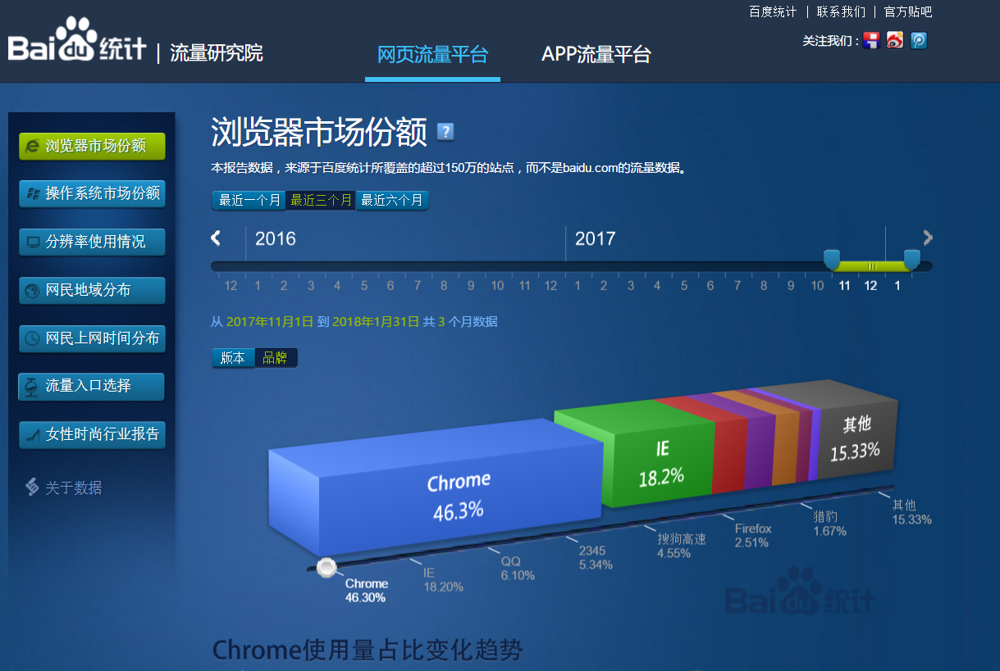
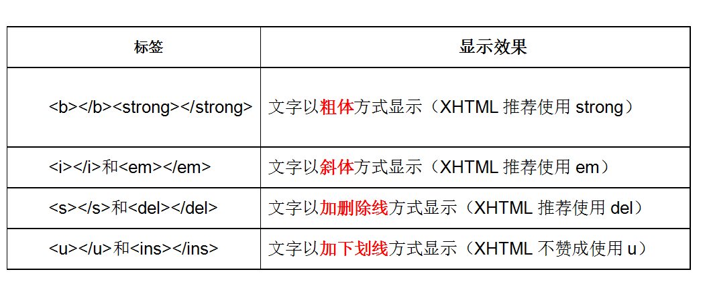
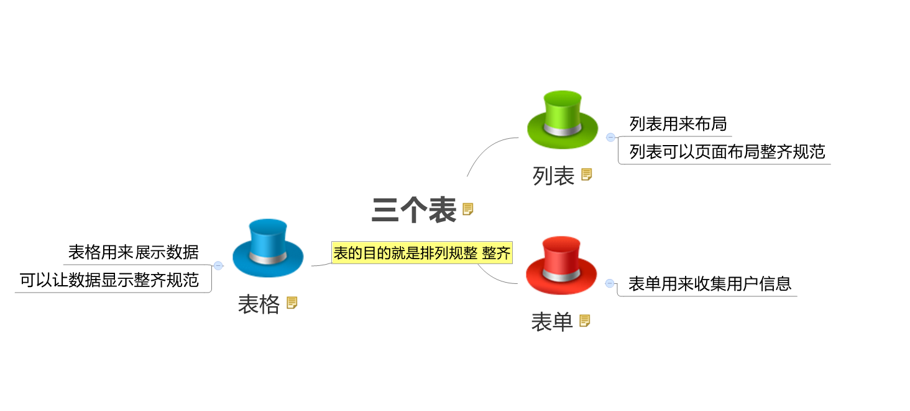
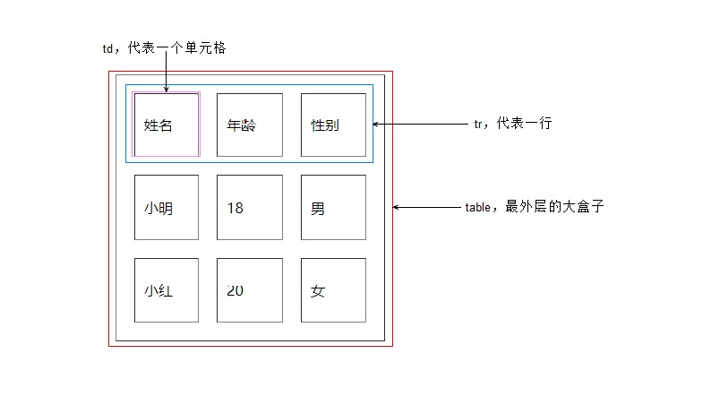
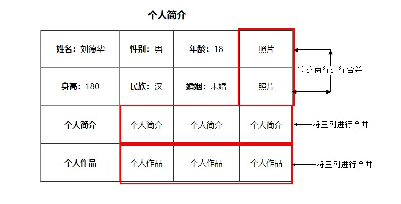
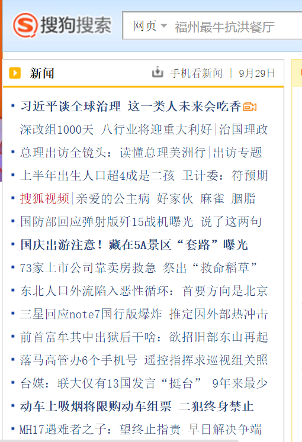

> 前端HTML基础
111
# 一、认识WEB

## 1. 认识网页

```
网页主要由文字、图像和超链接等元素构成。当然，除了这些元素，网页中还可以包含音频、视频以及Flash等。
```

## 2. 浏览器（显示代码）

平时我们浏览网页，是在浏览器地址栏中输入网页地址，就可以访问我们的页面了。你的浏览器呢？

```
浏览器是网页显示、运行的平台，常用的浏览器有IE、火狐（Firefox）、谷歌（Chrome）、Safari和Opera等。我们平时称为五大浏览器。
```

### 2.1 查看浏览器占有的市场份额

查看网站： <a href="http://tongji.baidu.com/data/browser" target="_blank">http://tongji.baidu.com/data/browser</a>
<!--  -->


。 

### 2.2 常见浏览器内核（了解）

首先解释一下浏览器内核是什么东西。英文叫做：Rendering Engine，中文翻译很多，排版引擎、解释引擎、渲染引擎，现在流行称为浏览器内核.

```
负责读取网页内容，整理讯息，计算网页的显示方式并显示页面.
```
因为浏览器太多啦， 但是现在主要流行的就是下面几个：

| 浏览器  |      内核      | 备注                                                         |
| :------ | :------------: | :----------------------------------------------------------- |
| IE      |    Trident     | IE、猎豹安全、360极速浏览器、百度浏览器                      |
| firefox |     Gecko      | 可惜这几年已经没落了，打开速度慢、升级频繁                   |
| Safari  |     webkit     | 现在很多人错误地把 webkit 叫做 chrome内核（即使 chrome内核已经是 blink 了）。 |
| chrome  | Chromium/Blink | 在 Chromium 项目中研发 Blink 渲染引擎（即浏览器核心），内置于 Chrome 浏览器之中。Blink 其实是 WebKit 的分支。大部分国产浏览器最新版都采用Blink内核。二次开发 |
| Opera   |     Presto     | Presto（已经废弃） 是挪威产浏览器 opera 的 "前任" 内核，为何说是 "前任"，因为最新的 opera 浏览器早已将之抛弃从而投入到了谷歌怀抱了。  现在用blink内核。 |

**拓展阅读：**
```
移动端的浏览器内核主要说的是系统内置浏览器的内核。

Android手机而言，使用率最高的就是Webkit内核，大部分国产浏览器宣称的自己的内核，基本上也是属于webkit二次开发。

iOS以及WP7平台上，由于系统原因，系统大部分自带浏览器内核，一般是Safari或者IE内核Trident的
```

## 3. Web标准（重点）

Web标准不是某一个标准，而是由W3C组织和其他标准化组织制定的一系列标准的集合。

W3C 万维网联盟是国际最著名的标准化组织。1994年成立后，至今已发布近百项相关万维网的标准，对万维网发展做出了杰出的贡献。

**w3c就类似于现实世界中的联合国。**

### 3.1 为什么要遵循WEB标准呢？

 通过以上浏览器的内核不同，我们知道他们渲染或者排版的模式就有些许差异，显示就会有差别。


### 3.2 Web 标准的好处

*1*、让Web的发展前景更广阔 
*2*、内容能被更广泛的设备访问
*3*、更容易被搜寻引擎搜索
*4*、降低网站流量费用
*5*、使网站更易于维护
*6*、提高页面浏览速度

专业的人做专业的事。  来呀~快活呀~反正有大把时间~

###  3.3 Web 标准构成

**构成：** 主要包括结构（Structure）、表现（Presentation）和行为（Behavior）三个方面。

* 结构标准：结构用于对网页元素进行整理和分类，咱们主要学的是HTML。 对于网页来说最重要的一部分


* 表现标准：表现用于设置网页元素的版式、颜色、大小等外观样式，主要指的是CSS
* 行为标准：行为是指网页模型的定义及交互的编写，咱们主要学的是 Javascript

 理想状态我们的源码： .HTML      .css      .js 

直观感受：


总结WEB标准：

结构标准：     决定你是否有个好天然身体 

**结构层：通过对语义的分析，可以对其划分结构。具有了结构的内容，将更容易阅读**

**表现层：是为了让网页就能展现出灵活多样的显示效果**


行为标准：     决定你是否有吸引人的行为

**行为层：用户对网页进行操作，网页可以做出响应性的变化。**


### 小结

* web标准有三层结构，分别是结构（html）、表现（css）和行为（javascript）  
* 结构类似人的身体， 表现类似人的着装， 行为类似人的行为动作
* 理想状态下，他们三层都是独立的， 放到不同的文件里面

## 4. 拓展@

* **介绍一下你对浏览器内核的理解？常见的浏览器内核有哪些？**

  浏览器内核包括两部分，渲染引擎和js引擎。渲染引擎负责读取网页内容，整理讯息，计算网页的显示方式并显示页面，js引擎是解析执行js获取网页的动态效果。 后来 JS 引擎越来越独立，内核就倾向于只指渲染引擎。
  IE：Trident 
  firefox：Gecko 
  chrom、safari：webkit 
  Opera：Presto 
  Microsoft Edge：EdgeHTML

  深度阅读：[五大主流浏览器内核的源起以及国内各大浏览器内核总结](http://blog.csdn.net/summer_15/article/details/71249203) 

> 第01阶段.前端基础.认识HTML

# **二、前端基础.认识HTML**

## 1. HTML 初识

- HTML 指的是超文本标记语言 (**H**yper **T**ext **M**arkup **L**anguage)是用来描述网页的一种语言。
- HTML 不是一种编程语言，而是一种标记语言 (markup language)
- 标记语言是一套标记标签 (markup tag)

**所谓超文本，有2层含义：** 

1. 因为它可以加入图片、声音、动画、多媒体等内容（**超越文本限制 **）
2. 不仅如此，它还可以从一个文件跳转到另一个文件，与世界各地主机的文件连接（**超级链接文本 **）。

```html
<h1> 我是一个大标题 </h1>
```

> 网页是由网页元素组成的 ， 这些元素是利用html标签描述出来，然后通过浏览器解析，就可以显示给用户了。

### 1.1 HTML骨架格式

| 标签名           |    定义    | 说明                                                    |
| ---------------- | :--------: | :------------------------------------------------------ |
| <html></html>    |  HTML标签  | 页面中最大的标签，我们成为  根标签                      |
| <head></head>    | 文档的头部 | 注意在head标签中我们必须要设置的标签是title             |
| <title></title> | 文档的标题 | 让页面拥有一个属于自己的网页标题                        |
| <body></body>    | 文档的主体 | 元素包含文档的所有内容，页面内容 基本都是放到body里面的 |
| <title></title> | 文档的标题 | 让页面拥有一个属于自己的网页标题                        |

### 1.2 HTML标签关系

主要针对于**双标签** 的相互关系分为两种：  请大家务必熟悉记住这种标签关系，因为后面我们标签嵌套特别多，很容易弄混他们的关系。

1. 嵌套关系

```html
<head>  
	<title> </title> 
</head>
```

2.并列关系

```html
<head></head>
<body></body>
```

**倡议：** 

> ```html
>  如果两个标签之间的关系是嵌套关系，子元素最好缩进一个tab键的身位（一个tab是4个空格）。如果是并列关系，最好上下对齐。
> ```

> html双标签 可以分为  有 一种是 父子级 包含关系的标签      一种是 兄弟级 并列关系的标签

## 2. 文档类型<!DOCTYPE>

同学你用啥手机？你咋回答？

**用法：**

```html
<!DOCTYPE html> 
```

**作用：**

<!DOCTYPE> 声明位于文档中的最前面的位置，处于 < html> 标签之前。此标签可告知浏览器文档使用哪种 HTML 或 XHTML 规范。

**注意：  **

一些老网站可能用的还是老版本的文档类型比如 XHTML之类的，但是我们学的是HTML5,而且HTML5的文档类型兼容很好(向下兼容的原则)，所以大家放心的使用HTML5的文档类型就好了

   <!DOCTYPE html>  就是告诉浏览器按照HTML5 规范解析页面.

> ```
> HTML文件必须加上 DOCTYPE 声明，并统一使用 HTML5 的文档声明
> ```

## 3. 页面语言lang

```html
<html lang="en">  指定html 语言种类
```

最常见的2个：

1. `en`定义语言为英语
2. `zh-CN`定义语言为中文

> <html lang="zh-CN"></html>  指定该html标签 内容 所用的语言为中文

**团队约定：**

> ```
> 考虑浏览器和操作系统的兼容性，目前仍然使用 zh-CN 属性值**
> ```

## 4. 字符集

```html
<meta charset="UTF-8" />
```

```
字符集(Character set)是多个字符的集合。

计算机要准确的处理各种字符集文字，需要进行字符编码，以便计算机能够识别和存储各种文字。
```

utf-8是目前最常用的字符集编码方式，常用的字符集编码方式还有gbk和gb2312。

- gb2312 简单中文  包括6763个汉字
- BIG5   繁体中文 港澳台等用
- GBK包含全部中文字符    是GB2312的扩展，加入对繁体字的支持，兼容GB2312
- UTF-8则基本包含全世界所有国家需要用到的字符
- **这句代码非常关键， 是必须要写的代码，否则可能引起乱码的情况。

> 这句话是让 html 文件是以 UTF-8 编码保存的， 浏览器根据编码去解码对应的html内容。

**团队约定：**

> ```
> 一般情况下统一使用 "UTF-8" 编码, 请尽量统一写成标准的 "UTF-8"，不要写成 "utf-8" 或 "utf8" 或 "UTF8"。
> ```

## 5. HTML标签的语义化

白话： 所谓标签语义化，就是指标签的含义。

1. 方便代码的阅读和维护
2. 同时让浏览器或是网络爬虫可以很好地解析，从而更好分析其中的内容 
3. 使用语义化标签会具有更好地搜索引擎优化 

> 根据标签的语义，在合适的地方给一个最为合理的标签

语义是否良好： 当我们去掉CSS之后，网页结构依然组织有序，并且有良好的可读性。(  裸奔起来一样好看 )

遵循的原则：先确定语义的HTML ，再选合适的CSS。

# 三. HTML常用标签

### 1）标题标签h

 单词缩写：  head   头部. 标题       title  文档标题

为了使网页更具有语义化，我们经常会在页面中用到标题标签，HTML提供了6个等级的标题，即

**标题标签语义：**  作为标题使用，并且依据重要性递减

其基本语法格式如下：

**小结 :**

- 加了标题的文字会变的加粗，字号也会依次变大
- 一行是只能放一个标题的

### 2）段落标签p

单词缩写：  paragraph  段落  [ˈpærəgræf]    无须记这个单词

**作用语义：**

可以把 HTML 文档分割为若干段落

 在网页中要把文字有条理地显示出来，离不开段落标签，就如同我们平常写文章一样，整个网页也可以分为若干个段落，而段落的标签就是

```html
<p>  文本内容  </p>
```

是HTML文档中最常见的标签，默认情况下，文本在一个段落中会根据浏览器窗口的大小自动换行。

### 3）水平线标签hr

单词缩写：  horizontal  横线    [ˌhɔrəˈzɑntl]    同上

在网页中常常看到一些水平线将段落与段落之间隔开，使得文档结构清晰，层次分明。这些水平线可以通过插入图片实现，也可以简单地通过标签来完成，<hr />就是创建横跨网页水平线的标签。其基本语法格式如下：

```html
<hr />是单标签 
```

### 4）换行标签br

单词缩写：  break   打断 ,换行

在HTML中，一个段落中的文字会从左到右依次排列，直到浏览器窗口的右端，然后自动换行。如果希望某段文本强制换行显示，就需要使用换行标签

```html
<br />
```

这时如果还像在word中直接敲回车键换行就不起作用了。

### 5）div 和  span标签(重点)

div   span    是没有语义的     是我们网页布局主要的2个盒子   想必你听过  css+div

div 就是  division  的缩写   分割， 分区的意思  其实有很多div 来组合网页。

span   跨度，跨距；范围    

语法格式：

```html
<div> 这是头部 </div>    <span>今日价格</span>
```

他们两个都是盒子，用来装我们网页元素的， 只不过他们有区别，现在我们记住

- div标签  用来布局的，但是现在一行只能放一个div
- span标签  用来布局的，一行上可以放好多个span

### 排版标签总结

| 标签名        | 定义       | 说明                                  |
| ------------- | :--------- | :------------------------------------ |
| <hx></hx>     | 标题标签   | 作为标题使用，并且依据重要性递减      |
| <p></p>       | 段落标签   | 可以把 HTML 文档分割为若干段落        |
| <hr />        | 水平线标签 | 没啥可说的，就是一条线                |
| <br />        | 换行标签   |                                       |
| <div></div>   | div标签    | 用来布局的，但是现在一行只能放一个div |
| <span></span> | span标签   | 用来布局的，一行上可以放好多个span    |

## 1.2 文本格式化标签

在网页中，有时需要为文字设置粗体、斜体或下划线效果，这时就需要用到HTML中的文本格式化标签，使文字以特殊的方式显示。



**区别：**

 b  只是加粗        strong  除了可以加粗还有 强调的意思，  语义更强烈。


## 1.3 标签属性

```html
<标签名 属性1="属性值1" 属性2="属性值2" …> 内容 </标签名>
<手机 颜色="红色" 大小="5寸">  </手机>
```

提倡：   尽量不使用 样式属性。    

## 1.4 图像标签img

单词缩写：   image  图像

要想在网页中显示图像就需要使用图像标签，接下来将详细介绍图像标签以及和他相关的属性。（它是一个单身狗）

语法如下：

```html

```

该语法中src属性用于指定图像文件的路径和文件名，他是img标签的必需属性。


**注意: **

1. 标签可以拥有多个属性，必须写在开始标签中，位于标签名后面。
2. 属性之间不分先后顺序，标签名与属性、属性与属性之间均以空格分开。
3. 任何标签的属性都有默认值，省略该属性则取默认值。
4. 采取  键值对 的格式   key="value"  的格式  

比如:  

```html
	正常的<br />
    <br />
     带有边框的<br />
    <br />
	有提示文本的<br />
	<br />
	有替换文本的<br />
	
```


## 1.5 链接标签(重点)

单词缩写：  anchor 的缩写  [ˈæŋkə(r)] 。基本解释 锚, 铁锚 的

在HTML中创建超链接非常简单，只需用标签把文字包括起来就好。

语法格式：

```html
<a href="跳转目标" target="目标窗口的弹出方式">文本或图像</a>
```

| 属性   | 作用                                                         |
| ------ | :----------------------------------------------------------- |
| href   | 用于指定链接目标的url地址，（必须属性）当为标签应用href属性时，它就具有了超链接的功能 |
| target | 用于指定链接页面的打开方式，其取值有_self和_blank两种，其中_self为默认值，_blank为在新窗口中打开方式。 |

**注意：**

1. 外部链接 需要添加 http:// www.baidu.com
2. 内部链接 直接链接内部页面名称即可 比如 < a href="index.html"> 首页 </a >
3. 如果当时没有确定链接目标时，通常将链接标签的href属性值定义为“#”(即href="#")，表示该链接暂时为一个空链接。
4. 不仅可以创建文本超链接，在网页中各种网页元素，如图像、表格、音频、视频等都可以添加超链接
5. 如何新窗口打开这个一个链接网页的？ target=“_blank”

## 2.锚点

#### 2.1 锚点定位 （难点）

通过创建锚点链接，用户能够快速定位到目标内容。

创建锚点链接分为两步：

```html
1. 使用相应的id名标注跳转目标的位置。 (找目标)
  <h3 id="two">第2集</h3> 

2. 使用<a href="#id名">链接文本</a>创建链接文本（被点击的） （拉关系）  我也有一个姓毕的姥爷..
  <a href="#two">   
```

#### 2.2 base 标签

**语法：**

```html
<base target="_blank" />
```

**总结： **

1. base 可以设置整体链接的打开状态   
2. base 写到  <head>  </head>  之间
3. 把所有的连接 都默认添加 target="_blank"

#### 2.3 预格式化文本pre标签

< pre> 标签可定义预格式化的文本。

被包围在 < pre> 标签 元素中的文本通常会保留空格和换行符。而文本也会呈现为等宽字体。

```html
<pre>

  此例演示如何使用 pre 标签

  对空行和 空格

  进行控制

</pre>
```

XHTML 是更严格更纯净的 HTML 代码。

- XHTML 指**可扩展超文本标签语言**（EXtensible HyperText Markup Language）。
- XHTML 的目标是取代 HTML。
- XHTML 与 HTML 4.01 几乎是相同的。
- XHTML 是更严格更纯净的 HTML 版本。
- XHTML 是作为一种 XML 应用被重新定义的 HTML。
- XHTML 是一个 W3C 标准。

#### 2.4 HTML和 XHTML之间有什么区别?

- XHTML 指的是可扩展超文本标记语言
- XHTML 与 HTML 4.01 几乎是相同的
- XHTML 是更严格更纯净的 HTML 版本
- XHTML 是以 XML 应用的方式定义的 HTML
- XHTML 是 2001 年 1 月发布的 W3C 推荐标准
- XHTML 得到所有主流浏览器的支持
- XHTML 元素是以 XML 格式编写的 HTML 元素。XHTML是严格版本的HTML，例如它要求标签必须小写，标签必须被正确关闭，标签顺序必须正确排列，对于属性都必须使用双引号等。

## 3. @深入阅读

[HTML5的崛起之路](http://www.chinaz.com/manage/2015/0720/424831.shtml)

> 第01阶段.前端基础.表格

# HTML

三个表（表格、表单、列表）



# 四、表格 table

**表格作用：**

存在即是合理的。  表格的现在还是较为常用的一种标签，但不是用来布局，**常见显示、展示表格式数据。**

因为它可以让数据显示的非常的规整，可读性非常好。

**特别是后台展示数据的时候表格运用是否熟练就显得很重要**，一个清爽简约的表格能够把繁杂的数据表现得很有条理，虽然 div 布局也可以做到，但是总没有表格来得方便。

## 1. 创建表格

在HTML网页中，要想创建表格，就需要使用表格相关的标签。

**创建表格的基本语法：**

```html
<table>
  <tr>
    <td>单元格内的文字</td>
    ...
  </tr>
  ...
</table>
```

要深刻体会表格、行、单元格他们的构成。

在上面的语法中包含基本的三对HTML标签，分别为 table、tr、td，他们是创建表格的基本标签，缺一不可，下面对他们进行具体地解释

1. table用于定义一个表格标签。

2. tr标签 用于定义表格中的行，必须嵌套在 table标签中。

3. td 用于定义表格中的单元格，必须嵌套在<tr></tr>标签中。

4. 字母 td 指表格数据（table data），即数据单元格的内容，现在我们明白，表格最合适的地方就是用来存储数据的。

   



**总结： **

- 表格的主要目的是用来显示特殊数据的
- 一个完整的表格有表格标签（table），行标签（tr），单元格标签（td）组成，没有列的标签

- <tr></tr>中只能嵌套<td></td> 类的单元格
- <td></td>标签，他就像一个容器，可以容纳所有的元素

## 2. 表格属性

表格有部分属性我们不常用，这里重点记住 cellspacing 、 cellpadding。


我们经常有个说法，是三参为0，  平时开发的我们这三个参数    border  cellpadding  cellspacing  为  0


```html
<table width="500" height="300" border="1" cellpadding="20" cellspacing="0" align="center">
   <tr>  <th>姓名</th>   <th>性别</th> <th>年龄</th>  </tr>
   <tr>  <td>刘德华</td> <td>男</td> <td>55</td>  </tr>
   <tr>  <td>郭富城</td> <td>男</td> <td>52</td>  </tr>
   <tr>  <td>张学友</td> <td>男</td> <td>58</td>  </tr>
   <tr>  <td>黎明</td>   <td>男</td> <td>18</td>  </tr>
   <tr>  <td>刘晓庆</td> <td>女</td> <td>63</td>  </tr>
</table>
```

## 3. 表头单元格标签th

- 作用：
  - 一般表头单元格位于表格的第一行或第一列，并且文本加粗居中
- 语法：
  - 只需用表头标签&lt;th&gt;</th&gt;替代相应的单元格标签&lt;td&gt;</td&gt;即可。 

 

**案例2：**

​	效果图


​	代码：

------

```html
<table width="500" border="1" align="center" cellspacing="0" cellpadding="0">
		<tr>  
			<th>姓名</th> 
			<th>性别</th>
			<th>电话</th>
		</tr>
		<tr>
			<td>小王</td>
			<td>女</td>
			<td>110</td>
		</tr>
		<tr>
			<td>小明</td>
			<td>男</td>
			<td>120</td>
		</tr>	
	</table>
```

> th 也是一个单元格   只不过和普通的 td单元格不一样，它会让自己里面的文字居中且加粗

## 4. 表格标题caption

**定义和用法**

```html
<table>
   <caption>我是表格标题</caption>
</table>
```

**注意： **

1. caption 元素定义**表格标题**，通常这个标题会被居中且显示于表格之上。
2. caption 标签必须紧随 table 标签之后。
3. 这个标签只存在 表格里面才有意义。

## 5. 合并单元格

合并单元格是我们比较常用的一个操作，但是不会合并的很复杂。

### 5.1 合并单元格2种方式

- 跨行合并：rowspan="合并单元格的个数"      
- 跨列合并：colspan="合并单元格的个数"



### 5.2 合并单元格顺序

> **合并的顺序我们按照   先上 后下     先左  后右 的顺序 **

跟我们以前学习汉字的书写顺序完全一致。

### 5.3 合并单元格三步曲

1. 先确定是跨行还是跨列合并
2. 根据 先上 后下   先左  后右的原则找到目标单元格    然后写上 合并方式 还有 要合并的单元格数量  比如 ： <td colspan="3">   </td>
3. 删除多余的单元格 单元格      

## 6. 总结表格

| 标签名              | 定义           | 说明                                         |
| ------------------- | :------------- | :------------------------------------------- |
| <table></table>     | 表格标签       | 就是一个四方的盒子                           |
| <tr></tr>           | 表格行标签     | 行标签要再table标签内部才有意义              |
| <td></td>           | 单元格标签     | 单元格标签是个容器级元素，可以放任何东西     |
| <th></th>           | 表头单元格标签 | 它还是一个单元格，但是里面的文字会居中且加粗 |
| <caption></caption> | 表格标题标签   | 表格的标题，跟着表格一起走，和表格居中对齐   |
| clospan 和 rowspan  | 合并属性       | 用来合并单元格的                             |

## 7.表格划分结构

```
对于比较复杂的表格，表格的结构也就相对的复杂了，所以又将表格分割成三个部分：题头、正文和脚注。而这三部分分别用:thead,tbody,tfoot来标注， 这样更好的分清表格结构
```

**注意：**

1. <thead></thead>：用于定义表格的头部。用来放标题之类的东西。< thead > 内部必须拥有 < tr > 标签！
2. <tbody></tbody>：用于定义表格的主体。放数据本体 。
3. <tfoot></tfoot>放表格的脚注之类。
4. 以上标签都是放到table标签中。

> 第01阶段.前端基础.列表和表单

# 五、列表和表单

## 1. 列表标签

### 1.1 无序列表 ul

无序列表的各个列表项之间没有顺序级别之分，是并列的。其基本语法格式如下：

```html
<ul>
  <li>列表项1</li>
  <li>列表项2</li>
  <li>列表项3</li>
  ......
</ul>
```

比如下面这些，新闻是没有顺序的，不用排队，先到先得，后发布先显示。

 

**脚下留心：**

```
 1. <ul></ul>中只能嵌套<li></li>，直接在<ul></ul>标签中输入其他标签或者文字的做法是不被允许的。
 2. <li>与</li>之间相当于一个容器，可以容纳所有元素。
 3. 无序列表会带有自己样式属性，放下那个样式，一会让CSS来！
```

### 1.2  有序列表 ol

有序列表即为有排列顺序的列表，其各个列表项按照一定的顺序排列定义，有序列表的基本语法格式如下：

```html
<ol>
  <li>列表项1</li>
  <li>列表项2</li>
  <li>列表项3</li>
  ......
</ol>
```

  所有特性基本与ul 一致。  但是实际中比 无序列表 用的少很多。

### 1.3 自定义列表

定义列表常用于对术语或名词进行解释和描述，定义列表的列表项前没有任何项目符号。其基本语法如下：

```html
<dl>
  <dt>名词1</dt>
  <dd>名词1解释1</dd>
  <dd>名词1解释2</dd>
  ...
  <dt>名词2</dt>
  <dd>名词2解释1</dd>
  <dd>名词2解释2</dd>
  ...
</dl>
```


### 1.4 列表总结

| 标签名    |     定义     | 说明                                                   |
| --------- | :----------: | :----------------------------------------------------- |
| <ul></ul> | **无序标签** | 里面只能包含li    没有顺序，我们以后布局中最常用的列表 |
| <ol></ol> |   有序标签   | 里面只能包含li    有顺序， 使用情况较少                |
| <dl></dl> |  自定义列表  | 里面有2个兄弟， dt 和 dd                               |

我们现在还没有学布局，现在只要保证2个点：

1. 学会什么时候用无序列表， 学会什么时候用自定义列表
2. 无序列表和自定义列表代码怎么写？
3. 具体的我们刚才看的布局，等我们学了css 在来全面布局。

## 2. 表单标签

**作用： **

表单目的是为了收集用户信息。

在我们网页中， 我们也需要跟用户进行交互，收集用户资料，此时也需要表单。

> 在HTML中，一个完整的表单通常由表单控件（也称为表单元素）、提示信息和表单域3个部分构成。


  **表单控件： **

​       包含了具体的表单功能项，如单行文本输入框、密码输入框、复选框、提交按钮、重置按钮等。

  **提示信息：**

​        一个表单中通常还需要包含一些说明性的文字，提示用户进行填写和操作。

  **表单域：**  

​      他相当于一个容器，用来容纳所有的表单控件和提示信息，可以通过他定义处理表单数据所用程序的url地址，以及数据提交到服务器的方法。如果不定义表单域，表单中的数据就无法传送到后台服务器。

### 2.1 input 控件(重点)

- 语法：

  ```html
  <input type="属性值" value="你好">
  ```

  - input 输入的意思 
  - <input /&gt;标签为单标签
  - type属性设置不同的属性值用来指定不同的控件类型
  - 除了type属性还有别的属性

- 常用属性：


#### 1. type 属性

- 这个属性通过改变值，可以决定了你属于那种input表单。
- 比如 type = 'text'  就表示 文本框 可以做 用户名， 昵称等。
- 比如 type = 'password'  就是表示密码框   用户输入的内容 是不可见的。

```html
用户名: <input type="text" /> 
密  码：<input type="password" />
```

#### 2. value属性   值

```html
用户名:<input type="text"  name="username" value="请输入用户名"> 
```

- value 默认的文本值。 有些表单想刚打开页面就默认显示几个文字，就可以通过这个value 来设置。

#### 3. name属性

```html
用户名:<input type="text"  name=“username” />  
```

name表单的名字， 这样，后台可以通过这个name属性找到这个表单。  页面中的表单很多，name主要作用就是用于区别不同的表单。

- name属性后面的值，是我们自己定义的。

- radio  如果是一组，我们必须给他们命名相同的名字 name   这样就可以多个选其中的一个啦

```html
<input type="radio" name="sex"  />男
<input type="radio" name="sex" />女
```

- name属性，我们现在用的较少， 但是，当我们学ajax 和后台的时候，是必须的。

#### 4. checked属性

- 表示默认选中状态。  较常见于 单选按钮和复选按钮。

```html
性    别:
<input type="radio" name="sex" value="男" checked="checked" />男
<input type="radio" name="sex" value="女" />女 
```

上面这个，表示就默认选中了 男 这个单选按钮

#### 5. input 属性小结

| 属性    | 说明     | 作用                                                   |
| ------- | :------- | ------------------------------------------------------ |
| type    | 表单类型 | 用来指定不同的控件类型                                 |
| value   | 表单值   | 表单里面默认显示的文本                                 |
| name    | 表单名字 | 页面中的表单很多，name主要作用就是用于区别不同的表单。 |
| checked | 默认选中 | 表示那个单选或者复选按钮一开始就被选中了               |

### 2.2 label标签

**目标：**

label标签主要目的是为了提高用户体验。 为用户提高最优秀的服务。

**概念：**

label 标签为 input 元素定义标注（标签）。

**作用：** 

 用于绑定一个表单元素, 当点击label标签的时候, 被绑定的表单元素就会获得输入焦点。

**如何绑定元素呢？**

1. 第一种用法就是用label直接包括input表单。

```html
<label> 用户名： <input type="radio" name="usename" value="请输入用户名">   </label>
```

   适合单个表单选择

1. 第二种用法 for 属性规定 label 与哪个表单元素绑定。

```html
<label for="sex">男</label>
<input type="radio" name="sex"  id="sex">
```

**pink老师 一句话说出他们:**

> 当我们鼠标点击 label标签里面的文字时， 光标会定位到指定的表单里面

### 2.3 textarea控件


- 语法：

```html
<textarea >
  文本内容
</textarea>
```

- 作用：

  通过textarea控件可以轻松地创建多行文本输入框.

  cols="每行中的字符数" rows="显示的行数"  我们实际开发不用

#### 文本框和文本域区别

| 表单              |  名称  |       区别       |                  默认值显示 |             用于场景 |
| :---------------- | :----: | :--------------: | --------------------------: | -------------------: |
| input type="text" | 文本框 | 只能显示一行文本 | 单标签，通过value显示默认值 | 用户名、昵称、密码等 |
| textarea          | 文本域 | 可以显示多行文本 |  双标签，默认值写到标签中间 |               留言板 |

### 2.4 select下拉列表

**目的：**

如果有多个选项让用户选择，为了节约空间，我们可以使用select控件定义下拉列表.


**语法：**

```html
<select>
  <option>选项1</option>
  <option>选项2</option>
  <option>选项3</option>
  ...
</select>
```

- 注意：

1. &lt;select&gt;  中至少包含一对 option 
2. 在option 中定义selected =" selected "时，当前项即为默认选中项。
3. 但是我们实际开发会用的比较少

## 3. form表单域

- 收集的用户信息怎么传递给服务器？

  通过form表单域

- 目的：

  在HTML中，form标签被用于定义表单域，以实现用户信息的收集和传递，form中的所有内容都会被提交给服务器。

**语法: **

```html
<form action="url地址" method="提交方式" name="表单名称">
  各种表单控件
</form>
```

**常用属性：**

| 属性   | 属性值   | 作用                                               |
| ------ | :------- | -------------------------------------------------- |
| action | url地址  | 用于指定接收并处理表单数据的服务器程序的url地址。  |
| method | get/post | 用于设置表单数据的提交方式，其取值为get或post。    |
| name   | 名称     | 用于指定表单的名称，以区分同一个页面中的多个表单。 |

**注意:**  

每个表单都应该有自己表单域。我们现在做页面，不写看不到效果，但是 如果后面学 ajax 后台交互的时候，必须需要 form表单域。

### 2.6 团队约定

### 元素属性

- 元素属性值使用双引号语法
- 元素属性值可以写上的都写上

*推荐：*

```html
<input type="text" />	
<input type="radio" name="name" checked="checked" />
```

*不推荐：*

```html
<input type=text  />	
<input type='text' />	
<input type="radio" name="name" checked />
```

## 5. 查文档

经常查阅文档是一个非常好的学习习惯

W3C :  http://www.w3school.com.cn/

MDN: https://developer.mozilla.org/zh-CN/