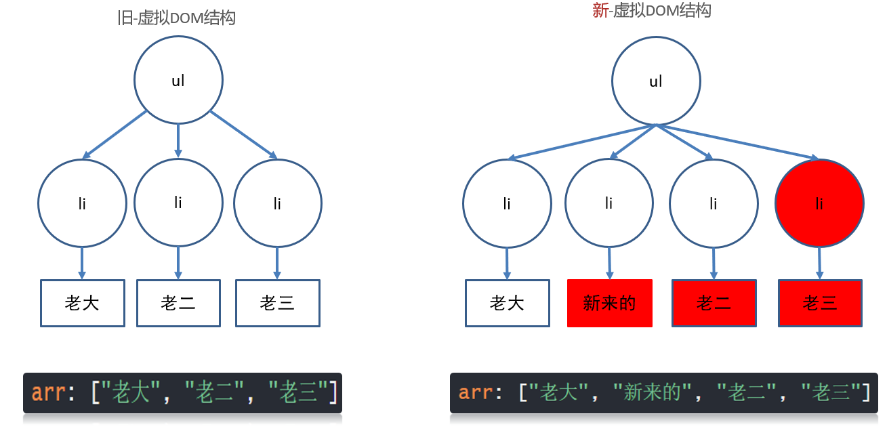

# Day03

## 知识点自测

- [ ] 重绘与回流(重排)的概念

```bash
回流(重排): 当浏览器必须重新处理和绘制部分或全部页面时，回流就会发生

重绘: 不影响布局, 只是标签页面发生变化, 重新绘制

注意: 回流(重排)必引发重绘, 重绘不一定引发回流(重排)
```

- [ ] localStorage浏览器本地存储语法使用

```bash
localStorage.setItem("key名", 值) - 把值存在浏览器本地叫key的对应位置上

localStorage.getItem("key名") - 把叫key的对应值, 从浏览器本地取出来

==值只能是字符串类型, 如果不是请用JSON.stringify转, 取出后用JSON.parse转==
```

- [ ] JSON的方法使用

```bash
JSON.stringify(JS数据) - 把JS数据序列化成JSON格式字符串

JSON.parse(JSON字符串)  - 把JSON格式化字符串, 再转回成JS数据
```

## 1. vue基础

### 1.0_vue基础 v-for更新监测

> 目标: 当v-for遍历的目标结构改变, Vue触发v-for的更新

情况1: 数组翻转

情况2: 数组截取

情况3: 更新值

口诀:

数组变更方法, 就会导致v-for更新, 页面更新

数组非变更方法, 返回新数组, 就不会导致v-for更新, 可采用覆盖数组或this.$set()

这些方法会触发数组改变, v-for会监测到并更新页面

- `push()`
- `pop()`
- `shift()`
- `unshift()`
- `splice()`
- `sort()`
- `reverse()`

这些方法不会触发v-for更新

* `slice()`
* `filter()`
* `concat()` 

> 注意: vue不能监测到数组里赋值的动作而更新, 如果需要请使用Vue.set() 或者this.$set(), 或者覆盖整个数组

> 总结:  改变原数组的方法才能让v-for更新

### 1.1_vue基础_v-for就地更新

`v-for` 的默认行为会尝试原地修改元素而不是移动它们。

> 详解v-for就地更新流程(可以看ppt动画)


这种 虚拟DOM对比方式, 可以提高性能 - 但是还不够高

### 1.2_vue基础_虚拟dom

> 目标: 了解虚拟DOM的概念

.vue文件中的template里写的标签, 都是模板, 都要被vue处理成虚拟DOM对象, 才会渲染显示到真实DOM页面上

1. 内存中生成一样的虚拟DOM结构(==本质是个JS对象==)

   因为真实的DOM属性好几百个, 没办法快速的知道哪个属性改变了

   比如template里标签结构

   ```vue
   <template>
       <div id="box">
           <p class="my_p">123</p>
       </div>
   </template>
   ```

   对应的虚拟DOM结构

   ```js
   const dom = {
       type: 'div',
       attributes: [{id: 'box'}],
       children: {
           type: 'p',
           attributes: [{class: 'my_p'}],
           text: '123'
       }
   }
   ```

2. 以后vue数据更新

   * 生成新的虚拟DOM结构
   * 和旧的虚拟DOM结构对比
   * 利用diff算法, 找不不同, 只更新变化的部分(重绘/回流)到页面 - 也叫打补丁

==好处1: 提高了更新DOM的性能(不用把页面全删除重新渲染)==

==好处2: 虚拟DOM只包含必要的属性(没有真实DOM上百个属性)==

> 总结: 虚拟DOM保存在内存中, 只记录dom关键信息, 配合diff算法提高DOM更新的性能

在内存中比较差异, 然后给真实DOM打补丁更新上


### 1.3_vue基础_diff算法

vue用diff算法, 新虚拟dom, 和旧的虚拟dom比较

#### 情况1: 根元素变了, 删除重建 

旧虚拟DOM

```vue
<div id="box">
    <p class="my_p">123</p>
</div>
```

新虚拟DOM

```vue
<ul id="box">
    <li class="my_p">123</li>
</ul>
```

#### 情况2: 根元素没变, 属性改变, ==元素复用==, 更新属性

旧虚拟DOM

```vue
<div id="box">
    <p class="my_p">123</p>
</div>
```

新虚拟DOM

```vue
<div id="myBox" title="标题">
    <p class="my_p">123</p>
</div>
```

### 1.4_vue基础_diff算法-key

#### 情况3: 根元素没变, 子元素没变, 元素内容改变

##### 无key - 就地更新

v-for不会移动DOM, 而是尝试复用, 就地更新，如果需要v-for移动DOM, 你需要用特殊 attribute `key` 来提供一个排序提示

```vue
<ul id="myUL">
    <li v-for="str in arr">
        {{ str }} 
        <input type="text">
    </li>
</ul>
<button @click="addFn">下标为1的位置新增一个</button>
```

```js
export default {
    data(){
        return {
            arr: ["老大", "新来的", "老二", "老三"]
        }
    },
    methods: {
        addFn(){
            this.arr.splice(1, 0, '新来的')
        }
    }
};
```

旧 - 虚拟DOM结构  和  新 - 虚拟DOM结构 对比过程



==性能不高, 从第二个li往后都更新了==

##### 有key - 值为索引 

 - 还是就地更新

因为新旧虚拟DOM对比, key存在就复用此标签更新内容, 如果不存在就直接建立一个新的

```vue
<ul id="myUL">
    <li v-for="(str, index) in arr" :key="index">
        {{ str }} 
        <input type="text">
    </li>
</ul>
<button @click="addFn">下标为1的位置新增一个</button>
```

```js
export default {
    data(){
        return {
            arr: ["老大", "新来的", "老二", "老三"]
        }
    },
    methods: {
        addFn(){
            this.arr.splice(1, 0, '新来的')
        }
    }
};
```


key为索引-图解过程 (又就地往后更新了)


1. v-for先循环产生新的DOM结构, key是连续的, 和数据对应

2. 然后比较新旧DOM结构, 找到区别, 打补丁到页面上

   最后补一个li, 然后从第二个往后, 都要更新内容

> 口诀: key的值有id用id, 没id用索引

##### 有key - 值为id 

key的值只能是唯一不重复的, 字符串或数值

v-for不会移动DOM, 而是尝试复用, 就地更新，如果需要v-for移动DOM, 你需要用特殊 attribute `key` 来提供一个排序提示

新DOM里数据的key存在, 去旧的虚拟DOM结构里找到key标记的标签, 复用标签

新DOM里数据的key存在, 去旧的虚拟DOM结构里没有找到key标签的标签, 创建

旧DOM结构的key, 在新的DOM结构里没有了, 则==移除key所在的标签==


> 总结: 不用key也不影响功能(就地更新), 添加key可以提高更新的性能

### 1.5_阶段小结

v-for什么时候会更新页面呢?

* 数组采用更新方法, 才导致v-for更新页面

vue是如何提高更新性能的?

* 采用虚拟DOM+diff算法提高更新性能

虚拟DOM是什么?

* 本质是保存dom关键信息的JS对象

diff算法如何比较新旧虚拟DOM?

* 根元素改变 – 删除当前DOM树重新建
* 根元素未变, 属性改变 – 更新属性
* 根元素未变, 子元素/内容改变
* 无key – 就地更新 / 有key – 按key比较

### 1.6_vue基础 动态class

> 目标: 用v-bind给标签class设置动态的值

* 语法:
  * :class="{类名: 布尔值}"
  * 使用场景: vue变量控制标签是否应该有类名

> 总结: 就是把类名保存在vue变量中赋予给标签

### 1.7_vue基础-动态style

> 目标: 给标签动态设置style的值

* 语法
  * :style="{css属性: 值}"

> 总结: 动态style的key都是css属性名

## 2. vue过滤器

### 2.0_vue过滤器-定义使用

> 目的: 转换格式, 过滤器就是一个**函数**, 传入值返回处理后的值

过滤器只能用在, ==插值表达式和v-bind表达式==

Vue中的过滤器场景

* 字母转大写, 输入"hello", 输出"HELLO"
* 字符串翻转, "输入hello, world", 输出"dlrow ,olleh"

语法: 

* Vue.filter("过滤器名", (值) => {return "返回处理后的值"})

* filters: {过滤器名字: (值) => {return "返回处理后的值"}

例子:

* 全局定义字母都大写的过滤器
* 局部定义字符串翻转的过滤器

> 总结: 把值转成另一种形式, 使用过滤器, Vue3用函数替代了过滤器.
>
> 全局注册最好在main.js中注册, 一处注册到处使用

### 2.1_vue过滤器-传参和多过滤器

> 目标: 可同时使用多个过滤器, 或者给过滤器传参

* 语法:
  * 过滤器传参:   vue变量 | 过滤器(实参) 
  * 多个过滤器:   vue变量 | 过滤器1 | 过滤器2

> 总结: 过滤器可以传参, 还可以对某个过滤器结果, 后面在使用一个过滤器

## 3. vue计算属性

### 3.0_vue计算属性-computed

> 目标: 一个数据, 依赖另外一些数据计算而来的结果

语法:

* ```js
  computed: {
      "计算属性名" () {
          return "值"
      }
  }
  ```

> 注意: 计算属性也是vue数据变量, 所以不要和data里重名, 用法和data相同

> 总结: 一个数据, 依赖另外一些数据计算而来的结果

### 3.1_vue计算属性-缓存

> 目标: 计算属性是基于它们的依赖项的值结果进行缓存的，只要依赖的变量不变, 都直接从缓存取结果


```vue
<template>
  <div>
    <p>{{ reverseMessage }}</p>
    <p>{{ reverseMessage }}</p>
    <p>{{ reverseMessage }}</p>
    <p>{{ getMessage() }}</p>
    <p>{{ getMessage() }}</p>
    <p>{{ getMessage() }}</p>
  </div>
</template>

<script>
export default {
  data(){
    return {
      msg: "Hello, Vue"
    }
  },
  // 计算属性优势:
  // 带缓存
  // 计算属性对应函数执行后, 会把return值缓存起来
  // 依赖项不变, 多次调用都是从缓存取值
  // 依赖项值-变化, 函数会"自动"重新执行-并缓存新的值
  computed: {
    reverseMessage(){
      console.log("计算属性执行了");
      return this.msg.split("").reverse().join("")
    }
  },
  methods: {
    getMessage(){
      console.log("函数执行了");
      return this.msg.split("").reverse().join("")
    }
  }
}
</script>

<style>

</style>
```

> 总结: 计算属性根据依赖变量结果缓存, 依赖变化重新计算结果存入缓存, 比普通方法性能更高

### 3.3_vue计算属性-完整写法

> 目标: 计算属性也是变量, 如果想要直接赋值, 需要使用完整写法

语法:

```js
computed: {
    "属性名": {
        set(值){
            
        },
        get() {
            return "值"
        }
    }
}
```

需求: 

* 计算属性给v-model使用

## 4. vue侦听器

### 4.0_vue侦听器-watch

> 目标: 可以侦听data/computed属性值改变

语法:

* ```js
  watch: {
      "被侦听的属性名" (newVal, oldVal){
          
      }
  }
  ```

完整例子代码:

```vue
  watch: {
    // newVal: 当前最新值
    // oldVal: 上一刻值
    name(newVal, oldVal){
      console.log(newVal, oldVal);
    }
  }
}
```

> 总结: 想要侦听一个属性变化, 可使用侦听属性watch

### 4.1_vue侦听器-深度侦听和立即执行  

> 目标: 侦听复杂类型, 或者立即执行侦听函数

* 语法:

  ```js
  watch: {
      "要侦听的属性名": {
          immediate: true, // 立即执行
          deep: true, // 深度侦听复杂类型内变化
          handler (newVal, oldVal) {
              
          }
      }
  }
  ```

完整例子代码:

```vue
  语法:
    watch: {
      变量名 (newVal, oldVal){
        // 变量名对应值改变这里自动触发
      },
      变量名: {
        handler(newVal, oldVal){

        },
        deep: true, // 深度侦听(对象里面层的值改变)
        immediate: true // 立即侦听(网页打开handler执行一次)
      }
    }
  */
  watch: {
    user: {
      handler(newVal, oldVal){
        // user里的对象
        console.log(newVal, oldVal);
      },
      deep: true,
      immediate: true
    }
  }
}
```

> 总结: immediate立即侦听, deep深度侦听, handler固定方法触发


## 面试题

### 1. Vue 中怎么自定义过滤器

​    Vue.js允许自定义过滤器，可被用于一些常见的文本格式化。过滤器可以用在两个地方：双花括号插值和v-bind表达式

​	全局的用Vue.filter()

​	局部的用filters属性

### 2. Vue中:key作用, 为什么不能用索引

​	:key是给v-for循环生成标签颁发唯一标识的, 用于性能的优化

​	因为v-for数据项的顺序改变，Vue 也不会移动 DOM 元素来匹配数据项的顺序，而是就地更新每个元素

​	:key如果是索引, 因为索引是连续的, 如果删除其中某一个, 会导致最后一个被删除

​	当我们再删除的时候, :key再根据数据来把新旧的dom对比时, 删除:key不存在的对应的标签(添加也是一样的插入到指定位置, 别的都不会动)

### 3. 数组更新有的时候v-for不渲染

​	因为vue内部只能监测到数组顺序/位置的改变/数量的改变, 但是值被重新赋予监测不到变更, 可以用 Vue.set() / vm.$set()

​                                                                                                                                                                                                    