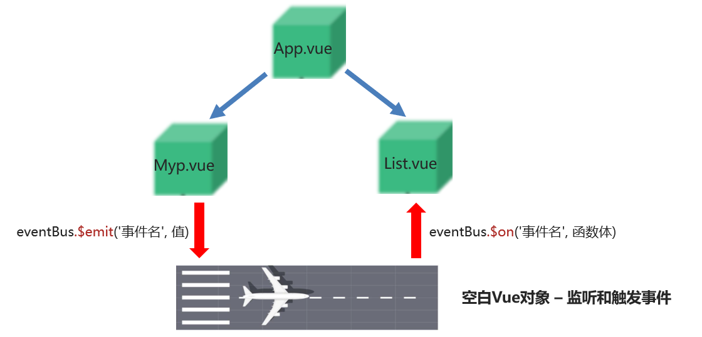

Day04

1. ​

## 1. vue组件

### 1.1_vue组件_概念

> 组件是可复用的 Vue 实例, 封装标签, 样式和JS代码

**组件化** ：封装的思想，把页面上 `可重用的部分` 封装为 `组件`，从而方便项目的 开发 和 维护

**一个页面， 可以拆分成一个个组件，一个组件就是一个整体, 每个组件可以有自己独立的 结构 样式 和 行为(html, css和js)**


### 1.2_vue组件_基础使用

> 目标: 每个组件都是一个独立的个体, 代码里体现为一个独立的.vue文件

口诀: 哪部分标签复用, 就把哪部分封装到组件内

==(重要): 组件内template只能有一个根标签==

==(重要): 组件内data必须是一个函数, 独立作用域==

步骤:

1. 创建组件 components/Pannel.vue

> 封装标签+样式+js - 组件都是独立的, 为了复用

2. 注册组件: 创建后需要注册后再使用

> ### 全局 - 注册使用

全局入口在main.js, 在new Vue之上注册

语法:

```js
import Vue from 'vue'
import 组件对象 from 'vue文件路径'

Vue.component("组件名", 组件对象)
```

main.js - 立即演示

```js
// 目标: 全局注册 (一处定义到处使用)
// 1. 创建组件 - 文件名.vue
// 2. 引入组件
import Pannel from './components/Pannel'
// 3. 全局 - 注册组件
/*
  语法: 
  Vue.component("组件名", 组件对象)
*/
Vue.component("PannelG", Pannel)
```

全局注册PannelG组件名后, 就可以当做标签在任意Vue文件中template里用

单双标签都可以或者小写加-形式, 运行后, 会把这个自定义标签当做组件解析, 使用==组件里封装的标签替换到这个位置==

```vue
<PannelG></PannelG>
<PannelG/>
<pannel-g></pannel-g>
```

> ### 局部 - 注册使用

语法:

```js
import 组件对象 from 'vue文件路径'

export default {
    components: {
        "组件名": 组件对象
    }
}
```

任意vue文件中中引入, 注册, 使用

```vue
<template>
  <div id="app">
    <h3>案例：折叠面板</h3>
    <!-- 4. 组件名当做标签使用 -->
    <!-- <组件名></组件名> -->
    <PannelG></PannelG>
    <PannelL></PannelL>
  </div>
</template>

<script>
// 目标: 局部注册 (用的多)
// 1. 创建组件 - 文件名.vue
// 2. 引入组件
import Pannel from './components/Pannel_1'
export default {
  // 3. 局部 - 注册组件
  /*
    语法: 
    components: {
      "组件名": 组件对象
    }
  */
  components: {
    PannelL: Pannel
  }
}
</script>
```

组件使用总结:

1. (创建)封装html+css+vue到独立的.vue文件中
2. (引入注册)组件文件 => 得到组件配置对象
3. (使用)当前页面当做标签使用

### 1.3_vue组件-scoped作用

> 目的: 解决多个组件样式名相同, 冲突问题

需求: div标签名选择器, 设置背景色

问题: 发现组件里的div和外面的div都生效了

解决: 给Pannel.vue组件里style标签上加scoped属性即可

```vue
<style scoped>
```

在style上加入scoped属性, 就会在此组件的标签上加上一个随机生成的data-v开头的属性

而且必须是当前组件的元素, 才会有这个自定义属性, 才会被这个样式作用到

> 总结: style上加scoped, 组件内的样式只在当前vue组件生效

## 2. vue组件通信

因为每个组件的变量和值都是独立的

组件通信先暂时关注父传子, 子传父

父: 使用其他组件的vue文件

子: 被引入的组件(嵌入)

例如: App.vue(父)  MyProduct.vue(子)

### 2.0_vue组件通信_父向子-props

### 2.1_vue组件通信_父向子-配合循环

> 目的: 把数据循环分别传入给组件内显示


> ### 单向数据流

在vue中需要遵循单向数据流原则
    1. 父组件的数据发生了改变，子组件会自动跟着变
    2. 子组件不能直接修改父组件传递过来的props  props是只读的

==父组件传给子组件的是一个对象，子组件修改对象的属性，是不会报错的，对象是引用类型, 互相更新==


> 总结: props的值不能重新赋值, 对象引用关系属性值改变, 互相影响

### 2.2_vue组件通信_单向数据流

> 目标: props变量本身是只读不能重新赋值

目标：从==父到子==的数据流向,叫==单向数据流==

原因: 子组件修改, 不通知父级, 造成数据不一致性

如果第一个MyProduct.vue内自己修改商品价格为5.5, 但是App.vue里原来还记着18.8 - 数据 不一致了

所以: Vue规定==props==里的变量, ==本身是只读==的


> 总结: 所以props变量本身是不能重新赋值的

问题:  那我怎么才能修改子组件接收到的值呢? - 其实要影响父亲, 然后数据响应式来影响儿子们

### 2.3_vue组件通信_子向父

> 目标: 从子组件把值传出来给外面使用

需求: 课上例子, 砍价功能, 子组件点击实现随机砍价-1功能

语法:

* 父: @自定义事件名="父methods函数"
* 子: this.$emit("自定义事件名", 传值) - 执行父methods里函数代码


> 总结: 父自定义事件和方法, 等待子组件触发事件给方法传值

### 2.4_阶段小结

> 目标: 总结父子组件关系-通信技术口诀

组件是什么?

* 是一个vue实例, 封装标签, 样式和JS代码

组件好处?

* 便于复用, 易于扩展

组件通信哪几种, 具体如何实现?

* 父 -> 子

* 父 <- 子

### 2.5_vue组件通信-EventBus

> 目标: 常用于跨组件通信时使用

两个组件的关系非常的复杂，通过父子组件通讯是非常麻烦的。这时候可以使用通用的组件通讯方案：事件总线（event-bus)



核心语法

EventBus/index.js- 定义事件总线bus对象

```js
import Vue from 'vue'
// 导出空白vue对象
export default new Vue()
```

components/MyProduct_sub.vue(==带学生主要写触发eventBus身上事件==)

```vue
<template>
  <div class="my-product">
    <h3>标题: {{ title }}</h3>
    <p>价格: {{ price }}元</p>
    <p>{{ intro }}</p>
    <button @click="subFn">宝刀-砍1元</button>
  </div>
</template>

<script>
import eventBus from '../EventBus'
export default {
  props: ['index', 'title', 'price', 'intro'],
  methods: {
    subFn(){
      this.$emit('subprice', this.index, 1) // 子向父
      eventBus.$emit("send", this.index, 1) // 跨组件
    }
  }
}
```

List.vue正确代码(==EventBus接收方==)

```vue
<template>
  <ul class="my-product">
    <li v-for="(item, index) in arr" :key="index">
      <span>{{ item.proname }}</span>
      <span>{{ item.proprice }}</span>
    </li>
  </ul>
</template>

<script>
// 目标: 跨组件传值
// 1. 引入空白vue对象(EventBus)
// 2. 接收方 - $on监听事件
import eventBus from "../EventBus";
export default {
  props: ["arr"],
  // 3. 组件创建完毕, 监听send事件
  created() {
    eventBus.$on("send", (index, price) => {
      this.arr[index].proprice > 1 &&
        (this.arr[index].proprice = (this.arr[index].proprice - price).toFixed(2));
    });
  },
};
</script>
```

> 总结: 空的Vue对象, 只负责$on注册事件, $emit触发事件, 一定要确保$on先执行

## 面试题

### 1. 请说下封装 vue 组件的过程

​    首先，组件可以提升整个项目的开发效率。能够把页面抽象成多个相对独立的模块，解决了我们传统项目开发：效率低、难维护、复用性等问题。

* 分析需求：确定业务需求，把页面中可以复用的结构，样式以及功能，单独抽离成一个组件，实现复用

* 具体步骤：Vue.component 或者在new Vue配置项components中, 定义组件名, 可以在props中接受给组件传的参数和值，子组件修改好数据后，想把数据传递给父组件。可以采用$emit方法。

### 2. Vue组件如何进行传值的

父向子 -> props定义变量 -> 父在使用组件用属性给props变量传值

子向父 -> $emit触发父的事件 -> 父在使用组件用@自定义事件名=父的方法 (子把值带出来)

### 3. Vue 组件 data 为什么必须是函数

每个组件都是 Vue 的实例, 为了独立作用域, 不让变量污染别人的变量

### 4. 讲一下组件的命名规范

​    给组件命名有两种方式(在Vue.Component/components时)，一种是使用链式命名"my-component"，一种是使用大驼峰命名"MyComponent"，

​	因为要遵循W3C规范中的自定义组件名 (字母全小写且必须包含一个连字符)，避免和当前以及未来的 HTML 元素相冲突
