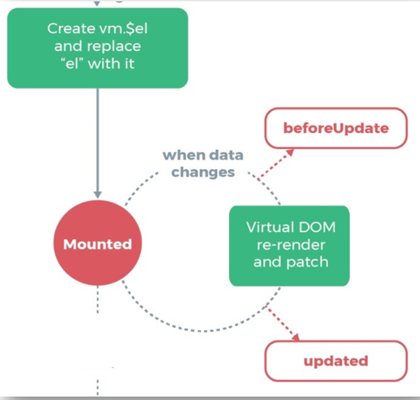

# Day05

1. ​

## 1. vue生命周期

Vue_生命周期


### 1.1_钩子函数

> 目标: **Vue** 框架内置函数，随着组件的生命周期阶段，自动执行

作用: 特定的时间点，执行特定的操作

场景: 组件创建完毕后，可以在created 生命周期函数中发起Ajax 请求，从而初始化 data 数据

分类: 4大阶段8个方法

- 初始化
- 挂载
- 更新
- 销毁

| **阶段** | **方法名**       | **方法名**   |
| ------ | ------------- | --------- |
| 初始化    | beforeCreate  | created   |
| 挂载     | beforeMount   | mounted   |
| 更新     | beforeUpdate  | updated   |
| 销毁     | beforeDestroy | destroyed |


### 1.2_初始化阶段

> 目标: 掌握初始化阶段2个钩子函数作用和执行时机

含义讲解:

1.new Vue() – Vue实例化(组件也是一个小的Vue实例)

2.Init Events & Lifecycle – 初始化事件和生命周期函数

3.beforeCreate – 生命周期钩子函数被执行

4.Init injections&reactivity – Vue内部添加data和methods等

5.created – 生命周期钩子函数被执行, 实例创建

6.接下来是编译模板阶段 –开始分析

7.Has el option? – 是否有el选项 – 检查要挂到哪里

​	没有. 调用$mount()方法

​	有, 继续检查template选项


### 1.3_挂载阶段

> 目标: 掌握挂载阶段2个钩子函数作用和执行时机

含义讲解:

1.template选项检查

​	有 - 编译template返回render渲染函数

​	无 – 编译el选项对应标签作为template(要渲染的模板)

2.虚拟DOM挂载成真实DOM之前

3.beforeMount – 生命周期钩子函数被执行

4.Create … – 把虚拟DOM和渲染的数据一并挂到真实DOM上

5.真实DOM挂载完毕

6.mounted – 生命周期钩子函数被执行


components/Life.vue - 创建一个文件

```html
<script>
export default {
    // ...省略其他代码
    
    // 二. 挂载
    // 真实DOM挂载之前
    // 场景: 预处理data, 不会触发updated钩子函数
    beforeMount(){
        console.log("beforeMount -- 执行");
        console.log(document.getElementById("myP")); // null

        this.msg = "重新值"
    },
    // 真实DOM挂载以后
    // 场景: 挂载后真实DOM
    mounted(){
        console.log("mounted -- 执行");
        console.log(document.getElementById("myP")); // p
    }
}
</script>
```

### 1.4_更新阶段

> 目标: 掌握更新阶段2个钩子函数作用和执行时机

含义讲解:

1.当data里数据改变, 更新DOM之前

2.beforeUpdate – 生命周期钩子函数被执行

3.Virtual DOM…… – 虚拟DOM重新渲染, 打补丁到真实DOM

4.updated – 生命周期钩子函数被执行

5.当有data数据改变 – 重复这个循环




components/Life.vue - 创建一个文件

准备ul+li循环, 按钮添加元素, 触发data改变->导致更新周期开始

```html
<script>
export default {

    // ...省略其他代码

    // 三. 更新
    // 前提: data数据改变才执行
    // 更新之前
    beforeUpdate(){
        console.log("beforeUpdate -- 执行");
        console.log(document.querySelectorAll("#myUL>li")[4]); // undefined
    },
    // 更新之后
    // 场景: 获取更新后的真实DOM
    updated(){
        console.log("updated -- 执行");
        console.log(document.querySelectorAll("#myUL>li")[4]); // li
    }
}
</script>
```

### 1.5_销毁阶段

> 目标: 掌握销毁阶段2个钩子函数作用和执行时机

含义讲解:

1.当$destroy()被调用 – 比如组件DOM被移除(例v-if)

2.beforeDestroy – 生命周期钩子函数被执行

3.拆卸数据监视器、子组件和事件侦听器

4.实例销毁后, 最后触发一个钩子函数

5.destroyed – 生命周期钩子函数被执行


components/Life.vue - 准备生命周期方法(Life组件即将要被删除)

```html
<script>
export default {
    // ...省略其他代码
    
    // 四. 销毁
    // 前提: v-if="false" 销毁Vue实例
    // 场景: 移除全局事件, 移除当前组件, 计时器, 定时器, eventBus移除事件$off方法
    beforeDestroy(){
        // console.log('beforeDestroy -- 执行');
        clearInterval(this.timer)
    },
    destroyed(){
        // console.log("destroyed -- 执行");
    }
}
</script>
```


## 2. axios

### 2.0_axios基本使用

原生ajax写法：

`

1、创建XMLHttpRequest对象

let xhr=new XMLHttpRequest()

2、设置本次请求的类型以及请求的地址

xhr.open('get/post','url')       

3、监听请求完成事件

xhr.onload = function(){ 

​	var res = xhr.responseText                          //拿到请求返回的结果			

} 

4、发送请求

xhr.send()

`

[axios文档](http://www.axios-js.com/)

特点

* 支持客户端发送Ajax请求
* 支持服务端Node.js发送请求
* 支持Promise相关用法
* 支持请求和响应的拦截器功能
* 自动转换JSON数据
* axios 底层还是原生js实现, 内部通过Promise封装的

axios的基本使用

```js
axios({
  method: '请求方式', // get post
  url: '请求地址',
  data: {    // 拼接到请求体的参数,  post请求的参数
    xxx: xxx,
  },
  params: {  // 拼接到请求行的参数, get请求的参数
   	xxx: xxx 
  }
}).then(res => {
  console.log(res.data) // 后台返回的结果
}).catch(err => {
  console.log(err) // 后台报错返回
})

```

### 2.1_axios基本使用-获取数据

> 目标: 调用文档最后_获取所有图书信息接口

功能: 点击调用后台接口, 拿到所有数据 – 打印到控制台

接口: 参考预习资料.md – 接口文档

引入: 下载axios, 引入后才能使用

效果:

例子如下:

components/UseAxios.vue

### 2.4_axios基本使用-全局配置

> 目标: 避免前缀基地址, 暴露在逻辑页面里, 统一设置

```js
axios.defaults.baseURL = "http://123.57.109.30:3006"

// 所有请求的url前置可以去掉, 请求时, axios会自动拼接baseURL的地址在前面
getAllFn() {
    axios({
        url: "/api/getbooks",
        method: "GET", // 默认就是GET方式请求, 可以省略不写
    }).then((res) => {
        console.log(res);
    });
    // axios()-原地得到Promise对象
},
```

## 3. $nextTick和$refs知识

### 3.0 $refs-获取DOM

> 目标: 利用 ref 和 $refs 可以用于获取 dom 元素

components/More.vue

```vue
<template>
  <div>
      <p>1. 获取原生DOM元素</p>
      <h1 id="h" ref="myH">我是一个孤独可怜又能吃的h1</h1>
  </div>
</template>

<script>
// 目标: 获取组件对象
// 1. 创建组件/引入组件/注册组件/使用组件
// 2. 组件起别名ref
// 3. 恰当时机, 获取组件对象
export default {
    mounted(){
        console.log(document.getElementById("h")); // h1
        console.log(this.$refs.myH); // h1
    }
}
</script>

<style>

</style>
```

> 总结: 通过id / ref, 都可以获取原生DOM标签

### 3.1 $refs-获取组件对象

### 3.2 $nextTick使用

> #### Vue更新DOM-异步的


> 总结: 因为DOM更新是异步

### 3.4 组件name属性使用

> 目标: 可以用组件的name属性值, 来注册组件名字

问题: 组件名不是可以随便写的?

答案: 我们封装的组件-可以自己定义name属性组件名-让使用者有个统一的前缀风格

components/Com.vue

```vue
<template>
  <div>
      <p>我是一个Com组件</p>
  </div>
</template>

<script>
export default {
    name: "ComNameHaHa" // 注册时可以定义自己的名字
}
</script>
```


## 面试题

### 1、Vue 的 nextTick 的原理是什么? （高薪常问）

​    \1. 为什么需要 nextTick ，Vue 是异步修改 DOM 的并且不鼓励开发者直接接触 DOM，但有时候业务需要必须对数据更改--刷新后的 DOM 做相应的处理，这时候就可以使用 Vue.nextTick(callback)这个 api 了。

​    \2. 理解原理前的准备 首先需要知道事件循环中宏任务和微任务这两个概念,常见的宏任务有 script, setTimeout, setInterval, setImmediate, I/O, UI rendering 常见的微任务有 process.nextTick(Nodejs),Promise.then(), MutationObserver;

​    \3. 理解 nextTick 的原理正是 vue 通过异步队列控制 DOM 更新和 nextTick 回调函数先后执行的方式。如果大家看过这部分的源码，会发现其中做了很多 isNative()的判断，因为这里还存在兼容性优雅降级的问题。可见 Vue 开发团队的深思熟虑，对性能的良苦用心。

### 2、vue生命周期总共分为几个阶段？（必会）

   Vue 实例从创建到销毁的过程，就是生命周期。也就是从开始创建、初始化数据、编译模板、挂载Dom→渲染、更新→渲染、卸载等一系列过程，我们称这是 Vue 的生命周期。

**1****）beforeCreate**

​    在实例初始化之后，数据观测 (data observer) 和 event/watcher 事件配置之前被调用。

**2****）created**

​    在实例创建完成后被立即调用。在这一步，实例已完成以下的配置：数据观测 (data observer)， 属性和方法的运算，watch/event 事件回调。然而，挂载阶段还没开始，$el 属性目前不可见。

**3****）beforeMount**

​    在挂载开始之前被调用：相关的 render 函数首次被调用。

**4****）mounted**

​    el 被新创建的 vm.$el 替换，并挂载到实例上去之后调用该钩子。如果 root 实例挂载了一个文档内元素，当 mounted 被调用时 vm.$el 也在文档内。

**5****）beforeUpdate**

​    数据更新时调用，发生在虚拟 DOM 打补丁之前。这里适合在更新之前访问现有的 DOM，比如手动移除已添加的事件监听器。该钩子在服务器端渲染期间不被调用，因为只有初次渲染会在服务端进行。

**6****）updated**

​    由于数据更改导致的虚拟 DOM 重新渲染和打补丁，在这之后会调用该钩子。

**7****）activated**

​    keep-alive 组件激活时调用。该钩子在服务器端渲染期间不被调用。

**8****）deactivated**

​    keep-alive 组件停用时调用。该钩子在服务器端渲染期间不被调用。

**9****）beforeDestroy**

​    实例销毁之前调用。在这一步，实例仍然完全可用。该钩子在服务器端渲染期间不被调用。

**10****）destroyed**

​    Vue 实例销毁后调用。调用后，Vue 实例指示的所有东西都会解绑定，所有的事件监听器会被移除，所有的子实例也会被销毁。该钩子在服务器端渲染期间不被调用。

**11****）errorCaptured（2.5.0+ 新增）**

​    当捕获一个来自子孙组件的错误时被调用。此钩子会收到三个参数：错误对象、发生错误的组件实例以及一个包含错误来源信息的字符串。此钩子可以返回 false 以阻止该错误继续向上传播。

### 3、第一次加载页面会触发哪几个钩子函数？（必会）

   当页面第一次页面加载时会触发 beforeCreate, created, beforeMount, mounted 这几个钩子函数
